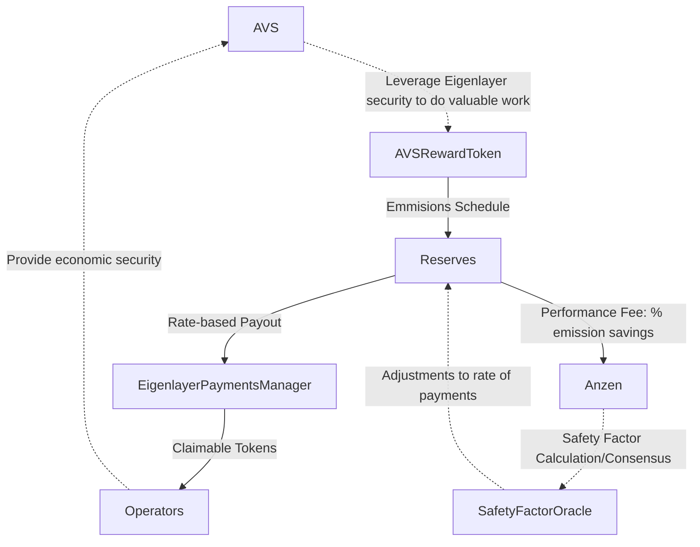

## Anzen Protocol

All of the information contained in this early Alpha release of the Anzen Protocol Contracts is likely to change prior to the launch of the protocol. This is released in this early state for research and educational purposes, and covers only a limited set of possible implementations and features of the Anzen Protocol.

## Contracts

The source code for each contract is in the [`contracts/`](contracts/)
directory.

| Contract                                                                      | Description                                                      | Deployment                                                                                   |
| ----------------------------------------------------------------------------- | ---------------------------------------------------------------- | -------------------------------------------------------------------------------------------- |
| [AVSReservesManagerFactory](contracts/src/core/AVSReservesManagerFactory.sol) | Factory for deploying AVSReservesManager contracts               | [0x8...1A0](https://goerli.etherscan.io/address/0x87641EA9Fb385820E726BaA1Fa3f8D35Be3B51A0)  |
| [AVSReservesManager](contracts/src/core/AVSReservesManager.sol)               | Coordinates payment emmissions from the AVS to the AVS operators | [0x4...A77](https://goerli.etherscan.io/address/0x419d8D025806F3cC118Bb1c110D8B12EaE1aEA77)  |
| [SafetyFactorOracle](contracts/src/core/SafetyFactorOracle.sol)               | Provides a safety factor feed for the given AVS                  | [0xb...083](https://goerli.etherscan.io/address/0xb67d80558b65099DC1F15D945513622f6436C083)  |
| [MockPaymentManager](contracts/test/mocks/MockPaymentManager.sol)             | Mock eigenlayer payment manager for testing purposes             | [0xb...2ab](https://goerli.etherscan.io//address/0xb0959F59cBe1b5b45628a4A5e8c24C0b85d052ab) |
| [MockAVS](contracts/test/mocks/MockAVS.sol)                                   | Mock AVS for testing purposes                                    |

## Payment Flow



## Usage

```shell
$ cd contracts
```

### Build

```shell
$ forge build
```

### Test

```shell
$ forge test
```

### Format

```shell
$ forge fmt
```

### Gas Snapshots

```shell
$ forge snapshot
```

### Anvil

```shell
$ anvil
```

### Deploy

```shell
forge script script/Deploy.s.sol:Deploy --rpc-url "https:ethereum-goerli.publicnode.com" --broadcast --verify -vvvv
```

### Help

```shell
$ forge --help
$ anvil --help
$ cast --help
```
