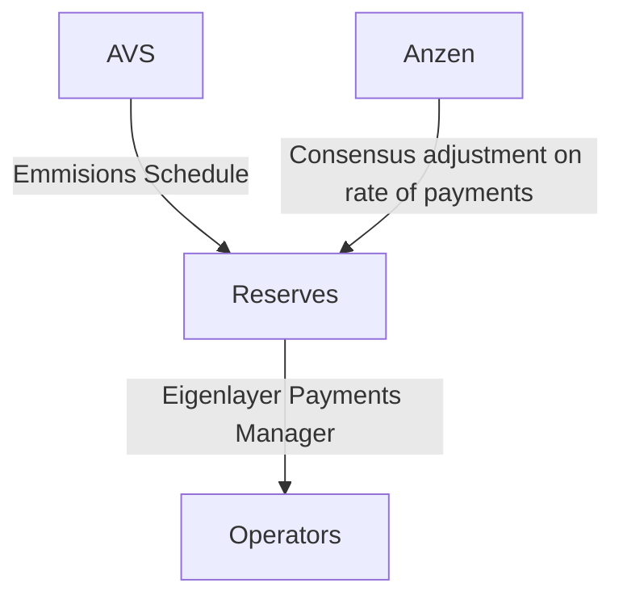

## Contracts

The source code for each contract is in the [`contracts/`](contracts/)
directory.

## Contracts

| Contract                                                          | Description                                                      |
| ----------------------------------------------------------------- | ---------------------------------------------------------------- |
| [`AVSReservesManager`](contracts/src/core/AVSReservesManager.sol) | Coordinates payment emmissions from the AVS to the AVS operators |

## Payment Flow



## Usage

```shell
$ cd contracts
```

### Build

### Test

```shell
$ forge test
```

### Format

```shell
$ forge fmt
```

### Gas Snapshots

```shell
$ forge snapshot
```

### Anvil

```shell
$ anvil
```

### Deploy

```shell
$ forge script script/Counter.s.sol:CounterScript --rpc-url <your_rpc_url> --private-key <your_private_key>
```

### Cast

```shell
$ cast <subcommand>
```

### Help

```shell
$ forge --help
$ anvil --help
$ cast --help
```
