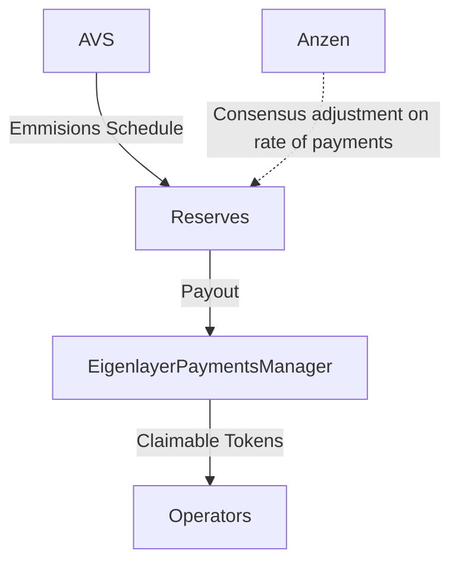

## Contracts

The source code for each contract is in the [`contracts/`](contracts/)
directory.

## Contracts

| Contract                                                                      | Description                                                      | Deployment                                                                                   |
| ----------------------------------------------------------------------------- | ---------------------------------------------------------------- | -------------------------------------------------------------------------------------------- |
| [AVSReservesManagerFactory](contracts/src/core/AVSReservesManagerFactory.sol) | Factory for deploying AVSReservesManager contracts               | [0x8...1A0](https://goerli.etherscan.io/address/0x87641EA9Fb385820E726BaA1Fa3f8D35Be3B51A0)  |
| [AVSReservesManager](contracts/src/core/AVSReservesManager.sol)               | Coordinates payment emmissions from the AVS to the AVS operators | [0x4...A77](https://goerli.etherscan.io/address/0x419d8D025806F3cC118Bb1c110D8B12EaE1aEA77)  |
| [SafetyFactorOracle](contracts/src/core/SafetyFactorOracle.sol)               | Provides a safety factor feed for the given AVS                  | [0xb...083](https://goerli.etherscan.io/address/0xb67d80558b65099DC1F15D945513622f6436C083)  |
| [MockPaymentManager](contracts/test/mocks/MockPaymentManager.sol)             | Mock eigenlayer payment manager for testing purposes             | [0xb...2ab](https://goerli.etherscan.io//address/0xb0959F59cBe1b5b45628a4A5e8c24C0b85d052ab) |
| [MockAVS](contracts/test/mocks/MockAVS.sol)                                   | Mock AVS for testing purposes                                    |

## Payment Flow



## Usage

```shell
$ cd contracts
```

### Build

### Test

```shell
$ forge test
```

### Format

```shell
$ forge fmt
```

### Gas Snapshots

```shell
$ forge snapshot
```

### Anvil

```shell
$ anvil
```

### Deploy

```shell
forge script script/Deploy.s.sol:Deploy --rpc-url "https:ethereum-goerli.publicnode.com" --broadcast --verify -vvvv
```

### Cast

```shell
$ cast <subcommand>
```

### Help

```shell
$ forge --help
$ anvil --help
$ cast --help
```
